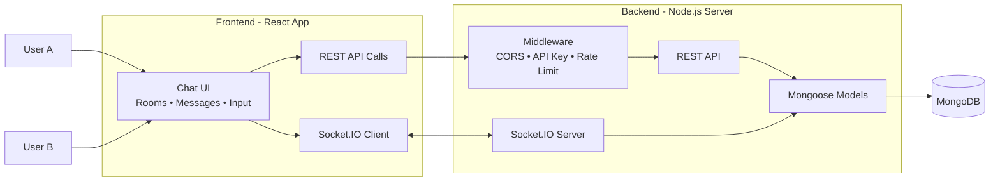

# Real-Time Chat Application

A full-stack real-time chat app with room-based messaging, message history, and live updates.

## Features

- Join and switch chat rooms
- Send and receive messages in real time
- Persist messages and room metadata in MongoDB
- Set display names with room-level uniqueness checks
- Load recent and older room messages

## Tech Stack

- Frontend: React, Vite, Material UI, Socket.IO Client
- Backend: Node.js, Express, Socket.IO, Mongoose
- Database: MongoDB

## Architecture



## Project Structure

```text
realtime-chat-app/
├── client/
│   ├── src/
│   │   ├── components/chat/
│   │   ├── constants/
│   │   ├── hooks/
│   │   ├── utils/
│   │   ├── App.jsx
│   │   └── main.jsx
│   └── package.json
├── server/
│   ├── src/
│   │   ├── config/
│   │   ├── db/
│   │   ├── middleware/
│   │   ├── models/
│   │   ├── routes/
│   │   └── sockets/
│   ├── app.js
│   └── package.json
└── README.md
```

## Quick Start

1. Clone and open the project.
2. Install dependencies.

```bash
cd server
npm install

cd ../client
npm install
```

3. Configure environment variables.

```bash
cd ../server
# PowerShell
Copy-Item .env.example .env
```

4. Start the backend.

```bash
cd server
npm run dev
```

5. Start the frontend in another terminal.

```bash
cd client
npm run dev
```

6. Open the app at `http://localhost:5173`.

## Environment Variables

Server `.env`:

- `MONGO_URI` MongoDB connection string
- `PORT` API server port (default `3000`)
- `CLIENT_ORIGIN` Allowed frontend origin (default `http://localhost:5173`)
- `API_KEY` Optional shared key for `/api` routes
- `RATE_LIMIT` Optional request limit per window
- `RATE_WINDOW_MS` Optional rate limit window in milliseconds

Client `.env`:

- `VITE_API_URL` Backend URL, for example `http://localhost:3000`

## Scripts

Server:

- `npm run dev` Start server with nodemon
- `npm start` Start server with Node.js

Client:

- `npm run dev` Start Vite dev server
- `npm run build` Build production bundle


## Default Local URLs

- Frontend: `http://localhost:5173`
- Backend: `http://localhost:3000`

## Notes

- Keep both client and server running during development.
- If CORS issues appear, make sure `CLIENT_ORIGIN` matches the frontend URL.
- If API key protection is enabled, include `x-api-key` in API requests.
